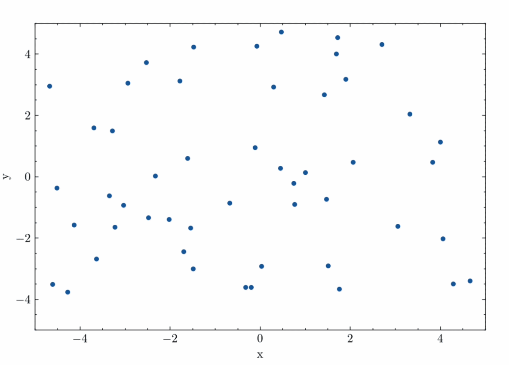

> [!NOTE]
> This project has **not** made any use of AI; all the work seen is my own, aided by the help of relevant documentation as and when needed (e.g. cppreference). Why? Well, although I understand and appreciate the utility/power of AI for programming, for me it simply takes the fun out of it. 

# Performance Analysis

All the performance tests below were carried out with the following simulation configuration:

| Parameter  | Value |
| ------------- | ------------- |
| Timestep  | 0.1s  |
| Max time  | 600s (10 mins)  |
| Iterations  | 6000  |
| Particle speed  | 0.4 ms^-1  |
| Neighbourhood radius  | 1.0m  |
| Spatial domain (2D)  | 5.0m x 5.0m  |

For the performance profiling, the profiler used was Hyperfine and the following parameters were set:

| Parameter  | Value |
| ------------- | ------------- |
| Warm-up / Dry runs  | 2  |
| Samples  | 5  |

## Serial computation

